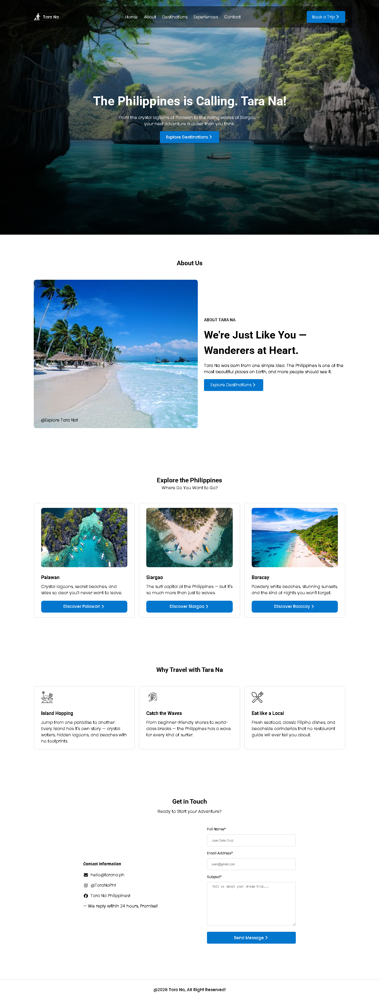

# Tara-Na — Discover the Philippines

A Philippines-themed travel website built to inspire wanderers and adventure to explore the beauty of the Filipino islands.

## About the Project

**Tara Na** is a static frontend travel website showcasing three of the most iconic destinations in the Philippines — Palawan, Siargao, and Boracay.

## Pages

- **Home** - Hero section with featured highlights.
- **About** - Story and mission of Tara Na.
- **Destinations** - Featuring iconic islands here in the Philippines (Palawan, Siargao, and Boracay).
- **Experiences** - What to do in the Philippines.
- **Contact** - Get in touch form

## Built With

- HTML5
- CSS3

## Screenshots

## Author

Made with 💖 by Jm Dūblon

Github: Dublonx

---

***Tara Na — The islands are waiting!***
